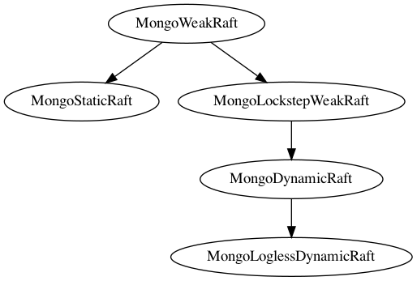

# MongoDB Logless Reconfig Protocol: Safety Proof Outline

## Overview

The new, logless MongoDB reconfiguration protocol, which we refer to as *MongoRaftReconfig*, extends the existing static Raft protocol, *MongoStaticRaft*, to allow for dynamic reconfiguration. At a high level, the *[MongoRaftReconfig](https://github.com/will62794/logless-reconfig/blob/a26545cb9d0a093ee24bd07d822f5535b865d370/refinement/MongoRaftReconfig.tla)* protocol is a composition of two conceptually distinct Raft based replicated state machines, which is how it is specified. We refer to these as the *oplog state machine (OSM)* and the *config state machine (CSM)*. The former is responsible for managing user data and the latter responsible for managing configuration state of the replica set. The CSM runs the *[MongoLoglessDynamicRaft](https://github.com/will62794/logless-reconfig/blob/a26545cb9d0a093ee24bd07d822f5535b865d370/refinement/MongoLoglessDynamicRaft.tla)* protocol, and the OSM runs the *[MongoStaticRaft](https://github.com/will62794/logless-reconfig/blob/a26545cb9d0a093ee24bd07d822f5535b865d370/refinement/MongoStaticRaft.tla)* protocol. *MongoRaftReconfig* is a composition of these two protocols, and each sub protocol (the OSM and CSM) operates over a subset of [common, global variables](https://github.com/will62794/logless-reconfig/blob/9c83df264e41cd6b51f1e9ed9c6d64a4deb300bd/refinement/MongoRaftReconfig.tla#L16-L23). The protocols do share some state, related to terms and elections, so the composition is not fully asynchronous. They synchronize on the election action i.e. both protocol must take an election step jointly. This composition is expressed formally in the *MongoRaftReconfig* [ specification](https://github.com/will62794/logless-reconfig/blob/a26545cb9d0a093ee24bd07d822f5535b865d370/refinement/MongoRaftReconfig.tla#L80-L123). Ultimately, we want to verify that *MongoRaftReconfig* satisfies the same high level safety properties as the static Raft protocol, which is the high level *StateMachineSafety* property. That is, we want to prove [this theorem](https://github.com/will62794/logless-reconfig/blob/a26545cb9d0a093ee24bd07d822f5535b865d370/refinement/MongoRaftReconfig.tla#L131).

## The Config State Machine

In order to verify the safety of the OSM, which we consider to be the "externally visible" state machine, we first need to ensure that the CSM behaves correctly i.e. we need to establish that *MongoLoglessDynamicRaft* is safe. To analyze the correctness of *MongoLoglessDynamicRaft* we reason about a higher level, log-based version of the protocol, which we refer to as *MongoDynamicRaft*. We first demonstrate the correctness of this higher level protocol and then show that *MongoLoglessDynamicRaft* is a refinement of it. This allows us to demonstrate safety of the logless protocol more easily, since we can reason directly about the history of log operations. We start by abstracting the safety conditions satisfied by *MongoStaticRaft* so that we can see how they are satisfied by *MongoDynamicRaft*.

The standard MongoDB replication protocol without reconfiguration is the *MongoStaticRaft* protocol. This protocol is safe, which was proven in the original [Raft dissertation proof](raft-dissertation-proof.pdf). A formal inductive invariant was not given in the original proof, but we can define a "Raft like" protocol as "safe" if it satisfies the 9 key safety lemmas proven in the original proof. That is, we can consider these lemmas as sufficient for defining an abstract meaning of safety for a Raft protocol. We let *StaticRaftSafety* be a property that is the conjunction of these 9 proof lemmas, which includes the high level *StateMachineSafety* property. The safety of *MongoStaticRaft* relies on an assumption that any two quorums must overlap. The satisfaction of *StaticRaftSafety*, however, does not depend on the use of quorums. So, we can define a more general protocol that still satisfies the same definition of safety without reliance on quorum overlap. We will call this protocol *MongoSafeWeakRaft*.  Before defining this protocol, we define an even weaker protocol, which we call *MongoWeakRaft*. This protocol is built by starting with *MongoStaticRaft* and allowing configurations on nodes to change arbitrarily, so that all assumptions about quorums used by different nodes are broken. Formally, this allows us to define *MongoStaticRaft* in terms of *MongoWeakRaft*, which is [how it is specified](https://github.com/will62794/logless-reconfig/blob/a26545cb9d0a093ee24bd07d822f5535b865d370/refinement/MongoStaticRaft.tla#L37-L58). *MongoWeakRaft* is [specified here](https://github.com/will62794/logless-reconfig/blob/a26545cb9d0a093ee24bd07d822f5535b865d370/refinement/MongoWeakRaft.tla), and it includes a formal definition of *[StateMachineSafety](https://github.com/will62794/logless-reconfig/blob/a26545cb9d0a093ee24bd07d822f5535b865d370/refinement/MongoWeakRaft.tla#L261-L263)*.

The *MongoWeakRaft* protocol is unsafe, since it removes all assumptions about quorums used by different nodes, but we can use it as a basis for defining our safe protocol *MongoSafeWeakRaft*. To do this, we can look at the safety properties included in *StaticRaftSafety* and try to abstract the conditions necessary for guaranteeing these properties without relying on quorum overlap. In the static protocol, quorum overlap is ultimately required to satisfy the following high level conditions:

1. If an election has occurred in term T, it prevents future elections in term T.
2. If an election has occurred in term T, it prevents entries from becoming committed in terms < T in the future.
3. If a leader is elected in term T, it must contain all entries committed in previous terms.

*MongoStaticRaft* relies on quorum overlap to enforce these conditions, but the conditions themselves don't inherently depend on the use of quorums. We can refer to these conditions collectively as  the *WeakQuorumCondition*. We claim that if *MongoWeakRaft* is modified to satisfy *WeakQuorumCondition*, this is sufficient for it to satisfy *StaticRaftSafety*. So, this is how we define *MongoSafeWeakRaft* i.e. we first [define the *WeakQuorumCondition*](https://github.com/will62794/logless-reconfig/blob/322f1dcadd1d7c5d57ce9f0e351416648d6f441a/refinement/MongoSafeWeakRaft.tla#L40-L56) precisely (as a state predicate), and then define *[MongoSafeWeakRaft](https://github.com/will62794/logless-reconfig/blob/322f1dcadd1d7c5d57ce9f0e351416648d6f441a/refinement/MongoSafeWeakRaft.tla#L58-L71)* in terms of *MongoWeakRaft* and *WeakQuorumCondition*. That is, the protocol behaves as *MongoWeakRaft* but must uphold *WeakQuorumCondition* on every transition.  Now that we have defined it, *MongoSafeWeakRaft* can serve as an alternative, abstract definition of "safety" for a Raft-like protocol. That is, we can say that any protocol that implements the *MongoSafeWeakRaft* specification is considered safe.

Finally, we want to show that *MongoDynamicRaft*, which is a log-based Raft protocol that allows for reconfiguration, is safe, which we can do by showing that it is a refinement of *MongoSafeWeakRaft*. We can do this by showing first that it is a refinement of *MongoWeakRaft* and then showing that it satisfies the *WeakQuorumCondition*. That is, we want to prove [this refinement theorem](https://github.com/will62794/logless-reconfig/blob/master/refinement/MongoDynamicRaft.tla#L273), and [this invariance theorem](https://github.com/will62794/logless-reconfig/blob/master/refinement/MongoDynamicRaft.tla#L274).

If we first prove the refinement theorem, then we can prove the invariance property inductively, by assuming that *WeakQuorumCondition* held in every state up to the current state. If we've established that the refinement holds, then we know that the protocol implemented *MongoWeakRaft* up to this point. So, we know that the protocol operated "safely" up to this point i.e. it implemented *MongoSafeWeakRaft* up to the current state. Then, we just need to prove that *WeakQuorumCondition* holds in the next state. This proof structure allows our induction hypothesis to assume that the standard safety properties about the static Raft protocol (*StaticRaftSafety*) hold in the current state, which helps us to prove the invariant. That is, we prove that if our *MongoDynamicRaft* protocol has operated as a *MongoSafeWeakRaft* system up to the current state, it will continue to do so in the next state.

## The Oplog State Machine

Once we have shown that the CSM is safe, we can then show that the OSM behaves correctly when composed with the CSM. Since elections are shared between the OSM and CSM, we already know that the election related conditions of the *WeakQuorumCondition* holds, but we will need to show the log related condition holds. Since we know that the CSM operates as a correct Raft state machine, and we know that a committed log entry must be committed in a current config before a reconfig is allowed, we should be able to show this fairly easily, by reasoning over the history of configs in the CSM. This allows us to show that *MongoRaftReconfig* also operates as a refinement of *MongoSafeWeakRaft*. This should be a much smaller part of the overall proof.

<!-- 
### Protocols Overview and Refinements

- `MongoWeakRaft` - A very general, weak protocol that places no restrictions on quorums used by nodes.
- `MongoStaticRaft` - The existing replication protocol used by MongoDB that is based on Raft. It does not allow for dynamic reconfiguration and it satisfies all the same safety properties as standard Raft, as described in the Raft dissertation. It implements `MongoWeakRaft` and should satisfy `StrictQuorumCondition`.
- `MongoLockstepWeakRaft` - Weak quorum protocol but requires a log entry be committed in a node's own quorum before writing a new entry.
- `MongoDynamicRaft` - A variant of `MongoStaticRaft` that allows for state machine operations to modify the configuration. This protocol keeps an explicit log and is closest to the Raft dissertation reconfig algorithm.
- `MongoLoglessDynamicRaft` - A variant of `MongoDynamicRaft` that optimizes away the log, and only stores the latest config on each node. The goal is to have this refine `MongoDynamicRaft`.
- `MongoRaftReconfig` - The new MongoDB protocol that allows for dynamic reconfiguration. Behaves as a composition of `MongoLoglessDynamicRaft` which runs the CSM and `MongoStaticRaft` which runs the OSM. -->