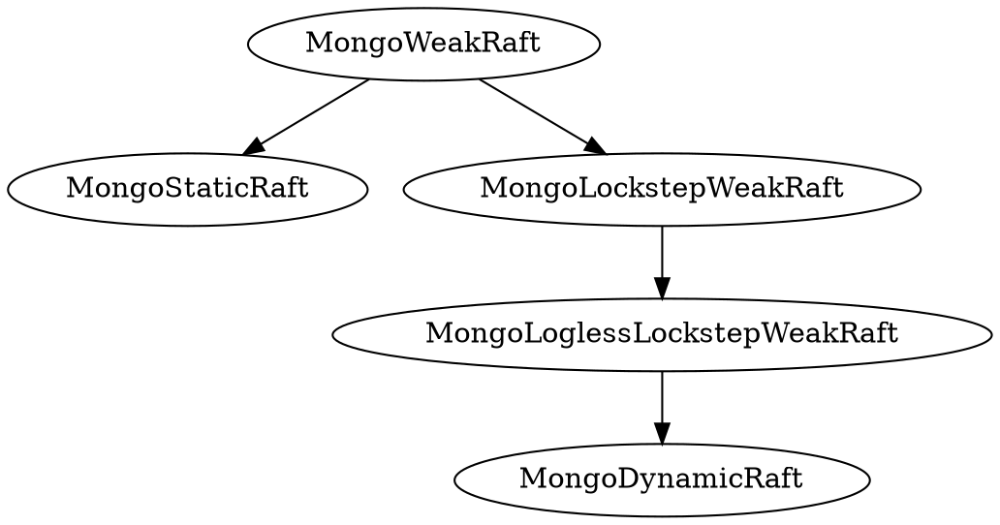

# Safety of MongoDB Reconfig

The standard MongoDB replication protocol, without any reconfiguration, is specified by the [`MongoStaticRaft`](MongoStaticRaft.tla) specification. This protocol is based on the standard Raft protocol and satisfies the same fundamental safety properties. The main safety property of Raft is the *state machine safety* property, which ensures that, if a log entry has been marked committed at a certain index, no conflicting log entry will ever be marked committed at the same index. We define this safety property as a temporal property `StateMachineSafety`. The theorem [`MongoStaticRaftSafety`](MongoStaticRaft.tla#L168) should hold i.e. it follows from the safety proof from the original Raft disseration. The new MongoDB reconfiguration protocol, which is specified in [`MongoRaftReconfig`](MongoRaftReconfig.tla), extends `MongoStaticRaft` to allow for reconfiguration changes. We want `MongoRaftReconfig` to satisfy the same property `Safety`. That is, we want the theorem [`MongoRaftReconfigSafety`](MongoRaftReconfig.tla#L103) to hold.

At a high level, the `MongoRaftReconfig` protocol is a composition of two conceptually distinct Raft state machines. We refer to these as the *oplog state machine (OSM)* and the *config state machine (CSM)*. The former is responsible for managing user data and the latter responsible for managing configuration state of the replica set. Both state machines run their protocols independently, but synchronize on some actions. The CSM runs a protocol described by the specification [`MongoDynamicRaft`](MongoDynamicRaft.tla), which is a Raft protocol that allows for operations of the state machine to change the definition of a quorum. The OSM runs the `MongoStaticRaft` protocol. `MongoRaftReconfig` is then a composition of these two protocols, where both protocols operate over a subset of a common, global set of variables. The protocols share some state, related to terms and elections, so the composition is not fully asynchronous. They synchronize on the election action i.e. both protocol must take an election step jointly. This composition is expressed formally in the [initial state predicate](MongoRaftReconfig.tla#L82-L84) and [next state relation](MongoRaftReconfig.tla#L86-L92) of the specification of the `MongoRaftReconfig` specification.

Since we consider the OSM to be the "externally visible" state machine, we ultimately want to make sure that it behaves correctly when composed with the CSM. Before we do this, however, we also need to make sure that the CSM behaves correctly i.e. we need to establish:

```tla
THEOREM MongoDynamicRaft!Spec => Safety
```


<!-- 
$$
\begin{aligned}
MongoRaftReconfig &\Rightarrow MongoWeakRaft \\
MongoRaftReconfig &\Rightarrow QC_2
\end{aligned}
$$  -->

### Protocol Glossary



- $MongoStaticRaft$ - The existing replication protocol used by MongoDB that is based on Raft. It does not allow for dynamic reconfiguration and it satisfies all the same safety properties as standard Raft, as described in the Raft dissertation.
- $MongoWeakRaft$ - A very general, weak protocol that places no restrictions on quorums used by nodes.
- $MongoLockstepWeakRaft$ - Weak quorum protocol but requires a log entry be committed in a node's own quorum before writing a new entry.
- $MongoLoglessLockstepWeakRaft$ - Logless version of  $MongoLockstepWeakRaft$.
- $MongoRaftReconfig$ - The new MongoDB protocol that allows for dynamic reconfiguration. Behaves as a composition of $MongoDynamicRaft$ running on the CSM and $MongoStaticRaft$ running on the OSM.


---------

<!--The new MongoDB reconfiguration protocol, which we refer to as *MongoDynamicRaft*, is built on top of 

We first consider the $StaticRaft$ protocol, which is what was originally formalized and proven correct in the Raft dissertation. This protocol does not allow for any reconfiguration i.e. the definition of quorums for each node is fixed. This protocol satisfies the requirement that any two quorums overlap, call it $QC_1$, which is necessary to ensure safety. We refer to the high level safety property as $Safety$. So, formally:

$$
StaticRaft \Rightarrow QC_1 \\
StaticRaft \Rightarrow Safety
$$

We claim, however, that $QC_1$ is technically a stronger requirement than necessary for this protocol to satisfy safety. This leads us to consider a more general version of the $StaticRaft$ protocol, called $WeakRaft$, which places no restrictions on what quorums can be used by any node. Formally:

$$
StaticRaft \iff WeakRaft \wedge QC_1
$$
That is, if we start with $WeakRaft$ and impose the quorum overlap restriction, this results in the protocol $StaticRaft$. If we impose a weaker restriction, though, $QC_2$, we claim that safety is still satisfied i.e.
$$
WeakRaft \wedge QC_2 \Rightarrow Safety
$$
Finally, we can view Raft with dynamic reconfiguration, $DynamicRaft$, as a special case of $WeakRaft$, that preserves $QC_2$. So, we claim that

$$
\begin{aligned}
DynamicRaft &\Rightarrow WeakRaft \\
DynamicRaft &\Rightarrow QC_2
\end{aligned}
$$

and these are the theorems we want to prove.-->


 

<!--We have two protocols $StaticRaft$ and $DynamicRaft$. We know that $StaticRaft$ satisfies a high level safety property $Safety$, under a certain assumption about quorum overlap, $QC_1$. We can state this theorem as:

$$
StaticSafety = \square QC_1 \wedge StaticRaft \Rightarrow Safety
$$

This is basically what was already proven in the Raft dissertation, so we can assume it without proof. 

Next we want to prove safety of $DynamicRaft$ protocol. If we can prove that $DynamicRaft$ is a refinement of $StaticRaft$, then we can show that

$$
DynamicRaft \Rightarrow StaticRaft
$$

But, this isn't quite sufficient since we know that $DynamicRaft$ breaks $QC_1$ i.e. the condition that any two quorums overlap. But there is a weaker condition $QC_2$ that is still sufficient for the $StaticSafety$ theorem i.e.

$$
StaticSafety2 = \square QC_2 \wedge StaticRaft \Rightarrow Safety
$$

So, if we can prove that

$$
DynamicRaft \Rightarrow \square QC_2
$$

then we should be able to establish that

$$
DynamicRaft \Rightarrow \square QC_2 \wedge StaticRaft
$$

which is enough to imply $Safety$, by the $StaticSafety2$ theorem.-->