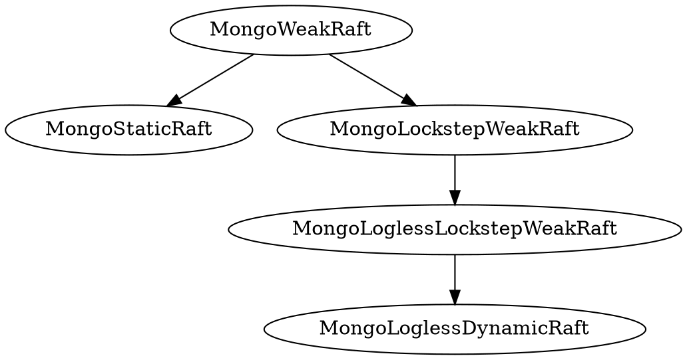

# Safety of MongoDB Logless Reconfig Protocol

The standard MongoDB replication protocol, without any reconfiguration, is specified by the [`MongoStaticRaft`](MongoStaticRaft.tla) specification. This protocol is based on the standard Raft protocol and satisfies the same fundamental safety properties. The main safety property of Raft is the *state machine safety* property, which ensures that, if a log entry has been marked committed at a certain index, no conflicting log entry will ever be marked committed at the same index. We define this safety property as a temporal property `StateMachineSafety`. The theorem [`MongoStaticRaftSafety`](MongoStaticRaft.tla#L168) should hold. It follows from the safety proof in the original Raft disseration. 

The new, logless MongoDB reconfiguration protocol, which is specified in [`MongoRaftReconfig`](MongoRaftReconfig.tla), extends `MongoStaticRaft` to allow for reconfiguration changes. Ultimately, our goal is to verify that `MongoRaftReconfig` satisfies the same safety property as the static protocol. That is, we want to verify [`MongoRaftReconfigSafety`](MongoRaftReconfig.tla#L103). At a high level, the `MongoRaftReconfig` protocol is a composition of two conceptually distinct Raft state machines. We refer to these as the *oplog state machine (OSM)* and the *config state machine (CSM)*. The former is responsible for managing user data and the latter responsible for managing configuration state of the replica set. Both state machines run their protocols independently, but synchronize on some actions. The CSM runs a protocol described by the specification [`MongoLoglessDynamicRaft`](MongoLoglessDynamicRaft.tla), which is a Raft protocol that allows for operations of the state machine to change the definition of a quorum. The OSM runs the `MongoStaticRaft` protocol. `MongoRaftReconfig` is a composition of these two protocols, and each sub protocol (the OSM and CSM) operates over a subset of [common, global variables](MongoRaftReconfig.tla#L16-L23). The protocols do share some state, related to terms and elections, so the composition is not fully asynchronous. They synchronize on the election action i.e. both protocol must take an election step jointly. This composition is expressed formally in the [specification](MongoRaftReconfig.tla#L75-L94) of `MongoRaftReconfig`.

To summarize the above protocols:
- `MongoStaticRaft`: The standard, static MongoDB Raft replication protocol where configurations are fixed. Safety of this protocol has already been proven.
- `MongoLoglessDynamicRaft`: An extended form of the static  protocol where state machine operations are allowed to change the quorum definition on different nodes.
- `MongoRaftReconfig`: the complete, new MongoDB replication protocol which allows for dynamic reconfiguration. It is built as a composition of `MongoStaticRaft`, used by the OSM, and `MongoLoglessDynamicRaft`, used by the CSM. Establishing safety of this protocol is our main goal.

## The Config State Machine

Ensuring that `MongoRaftReconfig` behaves safely ultimately means that we need to ensure that the OSM, which we consider as the "externally visible" state machine, 
operates safely when composed with the CSM. In order to do this, however, we first need to ensure that the CSM behaves correctly i.e. we need to establish that `MongoLoglessDynamicRaft` upholds state machine safety. The `MongoLoglessDynamicRaft` protocol is based on the `MongoStaticRaft` protocol, but it breaks some key assumptions necessary for ensuring safety of the static protocol. Thus, it is not a direct implementation of the `MongoStaticRaft` protocol, so it does not inherit its safety properties directly. 

More precisely, `MongoStaticRaft` relies on an assumption, which we refer to as `StrictQuorumCondition`, that any quorums used by different nodes will always intersect in at least one node. The set of quorums permitted for use by any node is based on the current configuration of that node, and since the configuration on all nodes is the same and never modified in `MongoStaticRaft`, use of a simple majority quorum system satisfies this condition. `MongoLoglessDynamicRaft` clearly violates this assumption, since the configurations on nodes may change in arbitrary ways. We can, however, consider a weaker, more general condition, which we call `WeakQuorumCondition`, that is sufficient to guarantee safety. This condition is derived from the fact that quorum overlap in standard Raft, for both voting and commitment, is not in and of itself necessary, but rather, is used as a mechanism to ensure that future candidates always contact at least some node that participated in a past election or log entry commitment. In order to consider protocols that can satisfy `WeakQuorumCondition` without necessarily satisfying `StrictQuorumCondition`, we define a more general version of the `MongoStaticRaft` protocol, which removes assumptions about what quorums can be used by separate nodes. This protocol is specified as [`MongoWeakRaft`](MongoWeakRaft.tla), and includes a formal definition of the [`StrictQuorumCondition`](MongoWeakRaft.tla#L180-L187) and [`WeakQuorumCondition`](MongoWeakRaft.tla#L189-L200) properties, which are both specified as state predicates.

Our claim is that any protocol that implements `MongoWeakRaft` and satisfies `WeakQuorumCondition` satisfies `StateMachineSafety`. We state this as the theorem [`WeakQuorumSafety`](MongoWeakRaft.tla#L241). Additionally, we note that the strict quorum condition implies the weak one. This is expressed in the theorem [`StrictQuorumImpliesWeakQuorum`](MongoWeakRaft.tla#L240).

So, now we aim to show that

```tla
MongoLoglessDynamicRaft!Spec => MongoWeakRaft!Spec        (refinement)
MongoLoglessDynamicRaft!Spec => WeakQuorumCondition       (invariance)
```
which, due to `WeakQuorumSafety`, is sufficient to imply

```tla
MongoLoglessDynamicRaft!Spec => Safety
```

which establishes our goal.

Refinement: We can show that `MongoLoglessDynamicRaft!Spec => MongoWeakRaft!Spec`, through a series of stepwise refinements between `MongoLoglessDynamicRaft` and `MongoWeakRaft` (TODO: Elaborate on these refinement steps). 

Invariance: We can show that `WeakQuorumCondition` is upheld by `MongoLoglessDynamicRaft` via an inductive invariance proof, which also utilizes the theorem `MongoStaticRaftSafety` theorem. 


## The Oplog State Machine

Once we have shown that the CSM is safe, we can then show that the OSM behaves correctly when composed with the CSM. That is, we want to show that

```tla
MongoRaftReconfig!Spec => MongoWeakRaft
MongoRaftReconfig!Spec => []WeakQuorumCondition
```
which is sufficient to prove that `MongoRaftReconfig!Spec` is safe. Since elections are shared between the OSM and CSM, we already know that the election related condition of `WeakQuorumCondition` holds for the `MongoRaftReconfig` spec, but we will need to show the log related condition holds. Since we know that the CSM operates as a correct Raft state machine, and we know that a committed log entry must be committed in a current config before a reconfig is allowed, we should be able to show this fairly easily, by reasoning over the history of configs in the CSM.

### Protocol Glossary



- $MongoStaticRaft$ - The existing replication protocol used by MongoDB that is based on Raft. It does not allow for dynamic reconfiguration and it satisfies all the same safety properties as standard Raft, as described in the Raft dissertation.
- $MongoWeakRaft$ - A very general, weak protocol that places no restrictions on quorums used by nodes.
- $MongoLockstepWeakRaft$ - Weak quorum protocol but requires a log entry be committed in a node's own quorum before writing a new entry.
- $MongoLoglessLockstepWeakRaft$ - Logless version of  $MongoLockstepWeakRaft$.
- $MongoRaftReconfig$ - The new MongoDB protocol that allows for dynamic reconfiguration. Behaves as a composition of $MongoLoglessDynamicRaft$ running on the CSM and $MongoStaticRaft$ running on the OSM.


---------

<!--The new MongoDB reconfiguration protocol, which we refer to as *MongoLoglessDynamicRaft*, is built on top of 

We first consider the $StaticRaft$ protocol, which is what was originally formalized and proven correct in the Raft dissertation. This protocol does not allow for any reconfiguration i.e. the definition of quorums for each node is fixed. This protocol satisfies the requirement that any two quorums overlap, call it $QC_1$, which is necessary to ensure safety. We refer to the high level safety property as $Safety$. So, formally:

$$
StaticRaft \Rightarrow QC_1 \\
StaticRaft \Rightarrow Safety
$$

We claim, however, that $QC_1$ is technically a stronger requirement than necessary for this protocol to satisfy safety. This leads us to consider a more general version of the $StaticRaft$ protocol, called $WeakRaft$, which places no restrictions on what quorums can be used by any node. Formally:

$$
StaticRaft \iff WeakRaft \wedge QC_1
$$
That is, if we start with $WeakRaft$ and impose the quorum overlap restriction, this results in the protocol $StaticRaft$. If we impose a weaker restriction, though, $QC_2$, we claim that safety is still satisfied i.e.
$$
WeakRaft \wedge QC_2 \Rightarrow Safety
$$
Finally, we can view Raft with dynamic reconfiguration, $DynamicRaft$, as a special case of $WeakRaft$, that preserves $QC_2$. So, we claim that

$$
\begin{aligned}
DynamicRaft &\Rightarrow WeakRaft \\
DynamicRaft &\Rightarrow QC_2
\end{aligned}
$$

and these are the theorems we want to prove.-->


 

<!--We have two protocols $StaticRaft$ and $DynamicRaft$. We know that $StaticRaft$ satisfies a high level safety property $Safety$, under a certain assumption about quorum overlap, $QC_1$. We can state this theorem as:

$$
StaticSafety = \square QC_1 \wedge StaticRaft \Rightarrow Safety
$$

This is basically what was already proven in the Raft dissertation, so we can assume it without proof. 

Next we want to prove safety of $DynamicRaft$ protocol. If we can prove that $DynamicRaft$ is a refinement of $StaticRaft$, then we can show that

$$
DynamicRaft \Rightarrow StaticRaft
$$

But, this isn't quite sufficient since we know that $DynamicRaft$ breaks $QC_1$ i.e. the condition that any two quorums overlap. But there is a weaker condition $QC_2$ that is still sufficient for the $StaticSafety$ theorem i.e.

$$
StaticSafety2 = \square QC_2 \wedge StaticRaft \Rightarrow Safety
$$

So, if we can prove that

$$
DynamicRaft \Rightarrow \square QC_2
$$

then we should be able to establish that

$$
DynamicRaft \Rightarrow \square QC_2 \wedge StaticRaft
$$

which is enough to imply $Safety$, by the $StaticSafety2$ theorem.-->